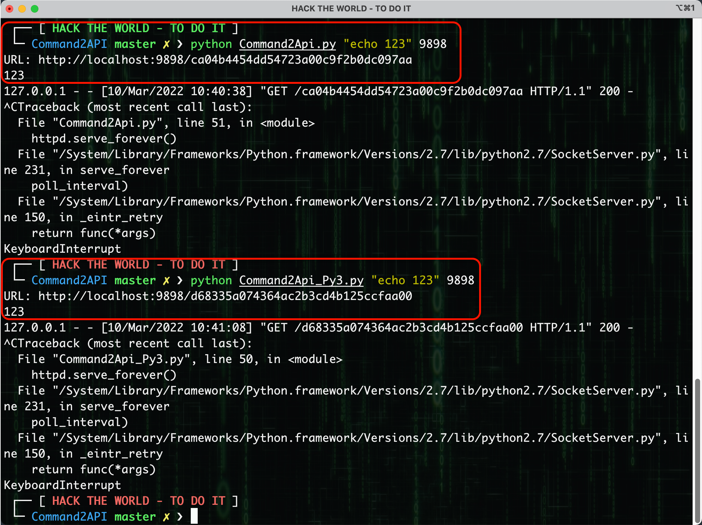

# Command2API

**作者**：key@元亨实验室

**简介**：这是一个可以实时获取执行命令结果的脚本，脚本原理就是一个线程开启Web服务，一个线程执行命令，通过全局变量与Web服务共享执行命令的结果。

## 使用方法

执行命令：

```shell
python Command2Api.py "执行的命令" Web运行的端口
python Command2Api_Py3.py "执行的命令" Web运行的端口 // Python3版本来自noobyan
```

接着在命令中会输出对应的URL，访问即可获取信息：



